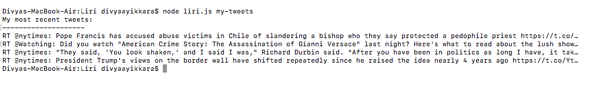
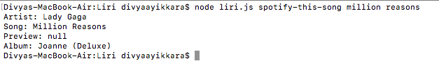
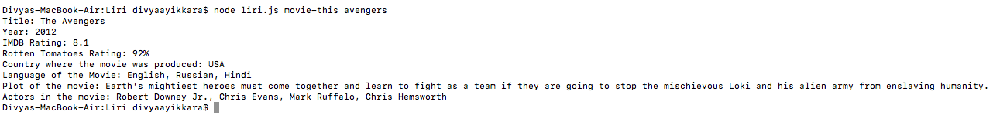
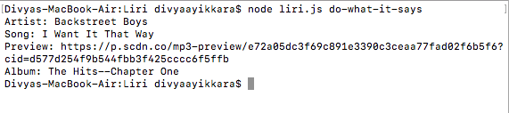

# Liri-Bot App

## Overview

LIRI is like iPhone's SIRI. However, while SIRI is a Speech Interpretation and Recognition Interface, LIRI is a Language Interpretation and Recognition Interface. 

## Instructions

First, you'll need to install these Node packages through your terminal/bash window:

- [Twitter](https://www.npmjs.com/package/twitter)
- [Spotify](https://www.npmjs.com/package/node-spotify-api)
- [Request](https://www.npmjs.com/package/request)

The Liri Bot can do four functions: 
- `node liri.js my-tweets`: this will show the last 20 tweets and when they were created at in the terminal/bash window.

- `node liri.js spotify-this-song <song name>`: this will show the following information about the song in the terminal/bash window:
	* Artist(s)
	* The song's name
	* A preview link of the song from Spotify
	* The album that the song is from 

- `node liri.js movie-this <movie's name>`: this will output the following information in the terminal/bash window:
	* Title of the movie.
	* Year the movie came out.
	* IMDB Rating of the movie.
	* Rotten Tomatoes Rating of the movie.
	* Country where the movie was produced.
	* Language of the movie.
	* Plot of the movie.
	* Actors in the movie.
	
	*If the user does not type a movie, the program will output data for the movie 'Mr. Nobody.'*

- `node liri.js do-what-it-says`: it should run 'spotify-this-song'  for "I Want it That Way".

